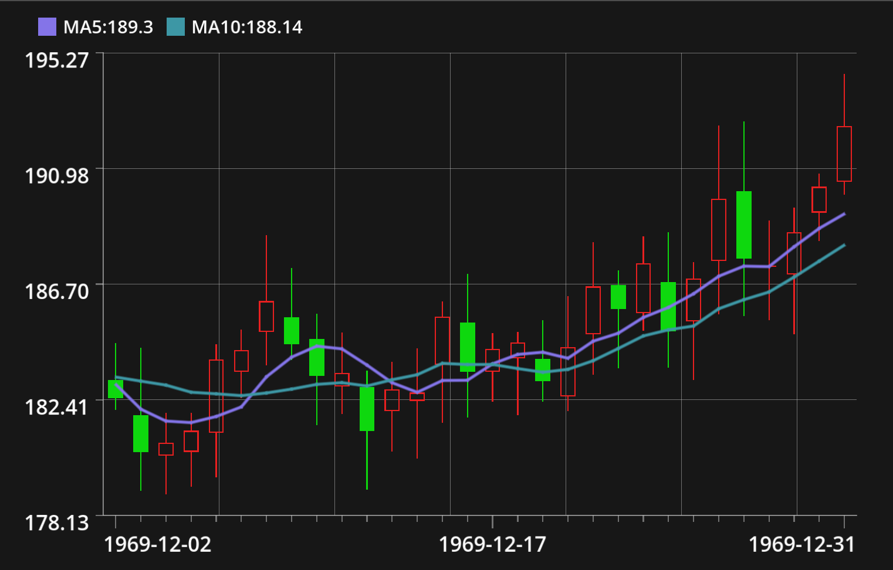
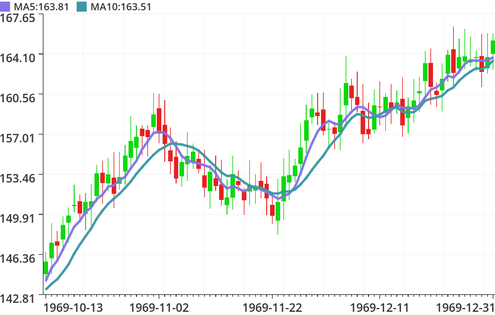
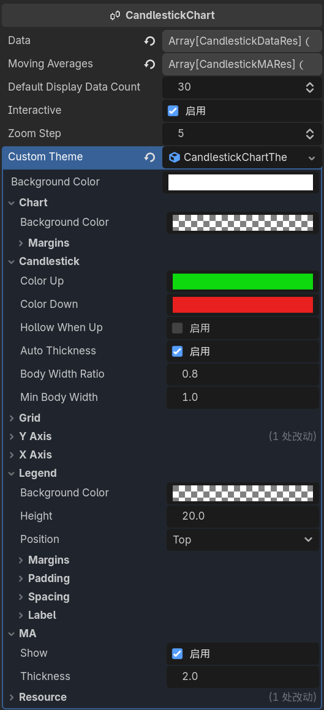

🇺🇸 **English** | [🇨🇳 中文](README-zh.md)

# Candlestick Chart — Godot Plugin

A candlestick chart control plugin for Godot 4.5+. It can be used as a custom node. Supports OHLC data sources, configurable moving averages (MA), theme customization, and basic interactions (wheel zoom / optional key bindings).

---

## Key Features

- Add and render candlestick charts in scenes via the custom node `CandlestickChart`.
- Uses resource-based data points (`CandlestickDataRes`) and moving average resources (`CandlestickMARes`).
- Customize colors, grid, axes, and legend styles through `CandlestickChartTheme`.
- Interactive zooming (mouse wheel or custom InputMap actions).
- Includes an `example` scene and script for quick preview and reference.

---

## Screenshots

<div style="display:flex;gap:20px;align-items:flex-start;">
	
	
	
</div>

---

## Installation

1. Copy the entire `addons/candlestick_chart` folder into your project's `res://addons/`.
2. Open the Godot editor, go to Project → Project Settings → Plugins, and enable the `CandlestickChart` plugin.
3. Add the node: like other `Control` nodes, you can add a `CandlestickChart` from the scene tree or instantiate it from script.

---

## Quick Start

The following example works with Godot 4.5+ and can be copied into any scene node's `_ready()`:

```gdscript
# Create and show a simple candlestick chart at runtime
func _ready() -> void:
	var chart: CandlestickChart = CandlestickChart.new()
	chart.size = Vector2(600, 400)
	add_child(chart)
	# Create example data and assign
	chart.data = [
		CandlestickDataRes.create("1970-01-01", 100.0, 105.0, 110.0, 95.0),
		CandlestickDataRes.create("1970-01-02", 105.0, 102.0, 108.0, 100.0),
		CandlestickDataRes.create("1970-01-03", 102.0, 108.0, 112.0, 101.0)
	]
	chart.default_display_data_count = 3
```

Alternatively, open the bundled example scene:

- Open `res://addons/candlestick_chart/example/example.tscn` and run it — `example.gd` will generate and assign random sample OHLC data for a quick preview.

---

## Important API Overview (exported properties)

- CandlestickChart (custom node, script at `addons/candlestick_chart/candlestick_chart.gd`)
  - `data: Array[CandlestickDataRes]` — Array of data points; each item is a `CandlestickDataRes` resource (timestamp/open/close/high/low).
  - `moving_averages: Array[CandlestickMARes]` — Array of moving average resources; multiple MAs can be drawn.
  - `default_display_data_count: int` — Number of data points shown by default (initial window).
  - `interactive: bool` — Whether interaction is enabled (default true).
  - `zoom_step: int` — Zoom step (how many data points change per zoom).
  - `custom_theme: CandlestickChartTheme` — Theme resource; if null a default theme is created.

- CandlestickDataRes (resource)
  - `timestamp: String` — Timestamp string (displayed on the X axis). Recommended format: `YYYY-MM-DD`.
  - `open: float`, `close: float`, `high: float`, `low: float` — OHLC values.
  - Static constructor: `CandlestickDataRes.create(timestamp, open, close, high, low)`.

- CandlestickMARes (resource)
  - `label_name: String` — The display name for the MA in the legend.
  - `period: int` — MA period (for example 5, 10, 20).
  - `color: Color` — MA color.
  - Static constructor: `CandlestickMARes.create(label_name, period, color)`.

- CandlestickChartTheme (resource, located in `candlestick_chart_theme.gd`)
  - The theme is controlled by exported properties on `CandlestickChartTheme`; you can create and save a `.tres` resource in the Inspector or from script for reuse.

---

## Example: Using moving averages (MA) and a custom theme

Create multiple MAs and apply a custom theme in script:

```gdscript
func _ready() -> void:
	var chart: CandlestickChart = CandlestickChart.new()
	chart.size = Vector2(600, 300)
	# Create and set MAs
	var ma5 := CandlestickMARes.create("MA5", 5, Color8(0,200,0))
	var ma20 := CandlestickMARes.create("MA20", 20, Color8(0,0,200))

	chart.moving_averages = [ma5, ma20]

	# Create and apply a custom theme
	var t := CandlestickChartTheme.new()
	t.candlestick_color_up = Color8(14,216,14)
	t.candlestick_color_down = Color8(232,32,32)
	t.grid_color = Color(0.8,0.8,0.8,0.3)
	chart.custom_theme = t
	add_child(chart)
```

---

## Interaction and input bindings

- The plugin will preferentially respond to `candlestick_chart_zoom_in` / `candlestick_chart_zoom_out` Input Map actions to trigger zooming.
- If not bound, the plugin defaults to mouse wheel events for zoom: wheel up to zoom in, wheel down to zoom out.

---

## Example scene notes

- `addons/candlestick_chart/example/example.tscn`: example scene; the included `example.gd` will randomly generate timestamped OHLC data and assign it to the chart node for a quick preview.
- To reuse the example script's generation logic, copy the code from `example.gd` into your scene script and point `$CandlestickChart` to your chart node path.
- The sample generation logic in the example script was assisted by AI and is intended for demonstration; coding style may differ from the rest of the plugin but is functionally compatible.

---

## Troubleshooting & Tips

- Custom node not visible or plugin missing: ensure `res://addons/candlestick_chart` exists and the plugin is enabled in Project Settings -> Plugins; try restarting the editor if needed.
- Empty chart or no data: ensure `data` is a non-empty array and items are `CandlestickDataRes`. At runtime, you can `print($CandlestickChart.get_vilid_data().size())` to verify.
- MA not visible: ensure `moving_averages` is non-empty, each `period` is reasonable (<= data length), and the theme's `ma_show` is true (usually enabled by default).
- Theme changes not applied: make sure you modified the `custom_theme` resource and assigned it to the chart; if editing in the editor, save the resource and reload if necessary.
- Zoom/key bindings not working: if you defined `candlestick_chart_zoom_in`/`candlestick_chart_zoom_out`, check them in Project Settings -> Input Map; otherwise test with mouse wheel.

---

## Contributing & License

- MIT License, see the LICENSE file.
- Contributions via Pull Requests or Issues are welcome to improve features, fix bugs, or provide feedback.
